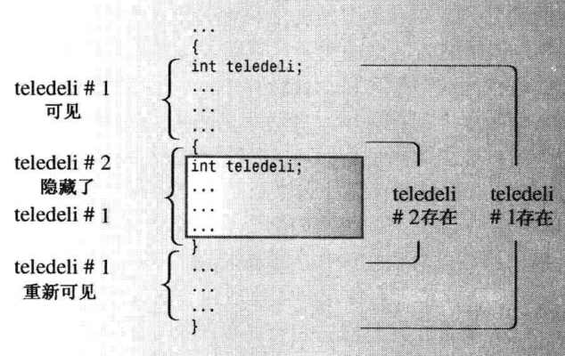

# 第九章 内存模型和名称空间

## 9.1 单独编译

C++ 和 C 一样，鼓励大家将函数放到单独的文件中进行编译。之前的例程中，很多的函数放在了一个文件之中，导致一个文件过于庞大，因此将函数放在不同的文件中，再利用头文件来引用，就可以将文件的结构变得更加的易读：

一般来说，头文件包含的内容有：

* 函数原型；
* 使用 `#define`或者`const`定义的符号常量；
* 结构声明；
* 类声明；
* 模板声明；
* 内联函数。

下面我们将展示一系列的程序：

程序9.1     coordin.h
---
```cpp
// coordin.h -- structure templates and function prototypes
// sturcture templates
#ifndef COORDIN_H_
#define COORDIN_H_

struct polar
{
    double distance; // distance from origin
    double angle;    // direction from origin
};

struct rect
{
    double x; // horizontal distance from origin
    double y; // vertical distance from origin
};

// prototypes
polar rect2polar(rect xypos);
void show_polar(polar dapos);

#endif
```

上面的头文件中`#ifndef` (if not defined) 避免多次包含同一个头文件，包含了一个头文件中包含的头文件。经过这个`#ifndef`语句处理过后，才会进行对于名称`COORDIN_H_`的定义。即处理`#ifndef`与`#endif`之间的内容。这样的方法并不是防止编译器对同一头文件包含两次，只是将除了第一次以外的包含内容忽略。

通常，`#define`语句用来创建符号常量，如下所示：
```cpp
#define MAXIMUM 4096
```

但是只要将`#define`用于名称就可以完成符号定义：

```cpp
#define COORDIN_H_
```

程序9.1     main.cpp

```cpp
// file1.cpp -- example of a three-file program
#include <iostream>
#include "coordin.h"    // 由于我的头文件和cpp文件放在同一路径内，所以这里直接包含头文件名

using namespace std;
int main(int argc, char *argv[])
{
    rect rplace;
    polar pplace;

    cout << "Enter the x and y values: ";
    while (cin >> rplace.x >> rplace.y)
    {
        pplace = rect2polar(rplace);
        show_polar(pplace);
        cout << "Next two numbers (q to quit): ";
    }
    cout << "Bye!\n";
    return 0;
}
```

程序9.2 func.cpp

```cpp
// func.cpp -- contains fucntions called in main.cpp

#include <iostream>
#include <cmath>
#include "coordin.h"    // structure templates, function prototypes

// convert rectangular to polar coordinates
polar rect2polar(rect xypos)
{
    using namespace std;
    polar answer;

    answer.distance =
        sqrt( pow(xypos.x,2) + pow(xypos.y,2));

    answer.angle = 
        atan2(xypos.y, xypos.x);
        return answer;
}

// show polar coordinates, converting angle to degrees
void show_polar(polar dapos)
{
    using namespace std;
    const double Rad2deg = 180/3.14;

    cout << "distance = " << dapos.distance;
    cout << "angle = " << dapos.angle * Rad2deg;
    cout << " degrees\n";
}

```

使用：
```
g++ -g func.cpp main.cpp -o  Coordin
```

对多个文件进行编译

程序输出：

```
Enter the x and y values: 2 3
distance = 3.60555angle = 56.3385 degrees
Next two numbers (q to quit): q
Bye!
```

## 9.2 储存持续性、作用域和连接性

### 9.2.1 作用域和链接

作用域（scope）描述了名称在文件（翻译单元）的多大范围可见。例如，函数中定义的变量可在该函数中使用，但是不能在其他的函数中使用；而文件中的函数定义之前定义的变量则可在所有函数中使用。

链接性（linkage）描述了名称如何在不同单元之间共享。链接性为外部的名称可以在文件间共享，链接性为内部的名称只能由一个文件中的函数共享。自动变量没有链接性，因为它们不能共享。

C++变量的作用域可以由多种。作用域为局部变量的只在定义它的函数体中可用（花括号括起来的{}）。作用域为全局（也叫做文件作用域）的变量在定义位置到文件结尾之间都可以使用。自动变量的作用域是局部，静态变量的作用域是全局还是局部取决于它是怎么被定义的。在名称空间中声明的变量，作用域是整个名称空间。

C++函数的作用域可以是整个类或者整个命名空间（包括全局的），但不是局部的。

### 9.2.2 自动储存持续性

默认情况下，在函数中声明的函数参数和变量储存持续性为自动，作用域为局部，没有连接性。也就是说，如果在`main()`和`oil()`函数中都声明了一个名为`tas`的变量，则会创建两个独立的变量 -- 只有在定义它们的函数中才能使用它们。当函数执行结束后，这些变量也就会消失。

那么如果在一个函数体中定义了一个变量`tas`又在函数体中的函数体中的新作用域内定义了变量`tas`情况会如何呢？



这表明，自动变量旨在包含它们的函数或代码块中可见。

程序 9.4    auto.cpp
```cpp
// auto.cpp -- illustrating scope of automatic variables
#include <iostream>
void oil(int years)
{
    using namespace std;

    int texas = 2;
    cout << "In oil(), texas = " << texas << ", &texas =";
    cout << &texas << endl;
    cout << "In oil, years = " << years << ", &years = ";
    cout << &years << endl;
    {
        int teaxs = 113;
        cout << "In oil(), texas = " << texas << ", &texas =";
        cout << &texas << endl;
        cout << "In oil, years = " << years << ", &years = ";
        cout << &years << endl;
    }
    cout << "Post-block texas = " << texas;
    cout << ", &texas = " << &texas << endl;
}

int main(int argc, char *argv[])
{
    using namespace std;

    int texas = 31;
    int years = 2011;
    cout << "In main(), texas = " << texas << ", &texas =";
    cout << &texas << endl;
    cout << "In main, years = " << years << ", &years = ";
    cout << &years << endl;
    oil(texas);
    cout << "In main(), texas = " << texas << ", &texas =";
    cout << &texas << endl;
    cout << "In main, years = " << years << ", &years = ";
    cout << &years << endl;
    return 0;
}
```

程序输出为：

```
In main(), texas = 31, &texas =0x61fe1c
In main, years = 2011, &years = 0x61fe18
In oil(), texas = 2, &texas =0x61fddc
In oil, years = 31, &years = 0x61fdf0
In block(), texas = 113, &texas =0x61fdd8
Post-block texas = 2, &texas = 0x61fddc
In main(), texas = 31, &texas =0x61fe1c
In main, years = 2011, &years = 0x61fe18
```

可以看出，3个`texas`的地址各不相同。这是因为程序在执行`main()`时，程序为`texas`和`year`分配空间，使得这些变量可见。当执行到过程`oil()`中的内部代码块时，原来的`texas`将不可见，它将被一个更新的定义代替。然而，当代码块运行结束时，其中定义的变量也将会过期。这类自动变量，会被编译器存放在栈中，其进出逻辑为先进后出。

### 9.2.3 静态持续变量

C++为静态存储持续变量提供了3种链接性：外部链接（可在其他文件种访问）、内部链接（只能在当前文件种访问）、无链接性（只能在当前函数或代码块种访问）。这3种链接性都在整个过程执行期间存在，与自动变量相比，它们的寿命更长。储存空间也不是栈而将被编译器分配固定的内存空间。

下面来介绍如果创建这3种静态持续变量：

1. 外部链接的静态持续变量需要在**代码块的外面**声明它。
2. 内部链接的静态持续变量需要在**代码块外**声明它，并使用`static`限制符。
3. 如果是没有连接性的静态持续变量，需要在**代码块内**声明它，并使用`static`限制符。

用代码的形式，分别展示以上方法：

```cpp
int global = 1000;          // static duration, external linkage
static int one_file = 50;   // static duration, internal linkage

int main()
{
    ...
}

void func1(int n)
{
    static int count = 0;   // static duration, no linkage
    int llama = 0;
}

void func2(int q)
{

}
```

如前面所说的，所有静态持续变量（global, one_file, count) 在整个程序执行期间都存在。在`func1`中声明的变量`count`的作用域为局部，没有连接性，这意味着只能在`func1()`函数中使用，就像自动变量`llama`一样，但是域`llama`不同的是，即使在`func1()`函数没有被执行的时候，`count`也会存在于存储中。而内外部链接的区别则是，内部的只能在一个文件中调用，而外部的则可以在其他的文件中使用。

### 9.2.4 静态持续性、外部连接性

单定义规则：

一方面，在每个使用外部变量的文件中，都必须声明它；另一方面，C++有“单定义规则” (One Definition Rule, ODR), 该规则指出，变量只能定义一次，为了满足这种需求，C++提供了两种变量声明。一种是定义声明 (defining declaration)或简称为定义 (definition)，它给变量分配储存空间；另外一种是引用声明 (referencing declaration) 或简称为声明 (declaration)，它不会给变量分配储存空间，因为它引用已有的变量。引用声明使用关键字`extern`，且不进行初始化；否则，声明为定义，导致分配内存空间：

```cpp
double up;              // definition, up is 0
extern int blem;        // blem defined elsewhere
extern char gr = 'z'    // defnition because initializad
```

如果要在多个文件种使用外部变量，只需要在一个文件中包含该变量的定义（单定义规则），但在使用该变量的其他所有文件中，都必须使用关键字 `extern` 声明它：

```cpp
// file01.cpp
extern int cats = 20;   // definition because of initialization
int dogs = 22;          // definition
int fleas;              // definition
...

// file02.cpp
// use cats and dogs from file01.cpp
extern int dogs;        // not definition because they use 
extern int cats;        // extern and have no initialization
...

// file03.cpp
// use cats, dogs, and fleas from file01.cpp
extern int dogs;
extern int cats;
extern int fleas;
```

下面用一个例程来展示这一概念：

**程序9.5**
```cpp
// external.cpp -- external variables
// compile with support.cpp

#include <iostream>
using namespace std;

// external variable
double warming = 0.3;    //warming defined
// function prototypes
void update(double dt);
void local();

int main(int argc, char const *argv[]) // uses global variable
{
    cout << "Global warming is " << warming << " degrees. \n";
    update(0.1);         // call function to change warming
    cout << "Global warming is " << warming << " degrees. \n";
    local();            // call function with local warming
    cout << "Global warming is " << warming << " degrees. \n";
    return 0;
}

```

**程序 9.6**

```cpp
// suppport.cpp -- use external variable
// complie with external.cpp
#include <iostream>
extern double warming;   // using warming from another file

// function prototypes
void update (double dt);
void local();

using std::cout;
void update (double dt) // modifies global variable
{
    extern double warming;  //optional redeclaration
    warming += dt;      // uses global warming
    cout << "Updating global warming to " << warming;
    cout << " degrees.\n";
}

void local()            // uses local variable
{
    double warming = 0.8;   // new variable hides external one

    cout << "Local warming = " << warming << " degrees.\n";
    // Access global variable with the 
    // scope resolution operator
    cout << "But global warming = " << ::warming;
    cout << " degrees.\n";
}
```

**程序输出：**

```
Global warming is 0.3 degrees.         
Updating global warming to 0.4 degrees.
Global warming is 0.4 degrees.         
Local warming = 0.8 degrees.
But global warming = 0.4 degrees.      
Global warming is 0.4 degrees. 
```

**程序说明：**

在上面的程序中，最值得关注的地方是`local()`函数，该函数中重新定义了一个局部变量`warming`，这个局部变量使得全局变量被隐藏了。此后，又使用了作用域运算符(::)获取到全局变量`warming`。

### 9.2.5 静态持续性、内部链接

将`static`限定符用于作用域为整个文件的变量时，该变量的链接性及那个为内部的。在多文件程序中，内部链接性和外部链接性之间的差别很大。并不是所有变量都需要成为全局变量，一些变量只需要在一个文件中使用，并且需要防止重名，需要使用`static`限定词将变量将变量限制在一个文件中。

下面还是由程序来演示这一方式的用法：

程序 9.7 twofile1.cpp

```cpp
// twofile1.cpp -- varibles with external and internal linkage
#include <iostream>
int tom = 3;            // external variable definition
int dick = 30;          // external variable definition
static int harry = 300; // static, internal linkage

// function prototype
void remote_access();

int main(int argc, char const *argv[])
{
    using namespace std;
    cout << "main() reports the following addresses: \n";
    cout << &tom << " = &tom," << &dick << " = &dick, ";
    cout << &harry << " = &harry\n";
    remote_access();
    return 0;
}
```

程序 9.9 twofile2.cpp

```cpp
// twofile2.cpp -- variables with internal and external linkage
#include <iostream>
extern int tom;       // tom defined elsewhere
static int dick = 10; // overrides external dick
int harry = 200;      // external variable definition,
                      // no confict with twofile1 harry

void remote_access()
{
    using std::cout;
    cout << "remote_access() reports the following addresses: \n";
    cout << &tom << " = &tom," << &dick << " = &dick, ";
    cout << &harry << " = &harry\n";
}
```

程序输出：

```
main() reports the following addresses:
0x403010 = &tom,0x403014 = &dick, 0x403018 = &harry
remote_access() reports the following addresses:
0x403010 = &tom,0x403020 = &dick, 0x403024 = &harry
```

### 9.2.6 静态储存持续性、无链接性

无链接性的持续变量是指在代码块中，用`static`限制的变量。它的特殊之处是在声明变量的函数结束后变量依然存在，因此二次调用依然可以使用，其变量的值只会在第一次被调用的时候被初始化，往后不会再初始化了。

下面用一个例程来展示

程序9.9 staticfile.cpp

```cpp
// static.cpp using a static local variable
#include <iostream>

// constants
const int ArSize = 10;
// function prototype
void strcount(const char *str);

int main()
{
    using namespace std;
    char input[ArSize];
    char next;

    cout << "Enter a line:\n";
    cin.get(input, ArSize);
    while (cin)
    {
        cin.get(next);
        while (next != '\n') // string didn't fit!
            cin.get(next);   // dispose of remainder
        strcount(input);
        cout << "Enter next line (empty line to quit):\n";
        cin.get(input, ArSize) ;
    }
    cout << "Bye\n";
    return 0;
}

void strcount(const char * str)
{
    using namespace std;
    static int total = 0; // static local varible
    int count = 0;        // auto local variable

    cout << "\"" << str << "\" constains ";
    while (*str++) // go to end of string
        count++;
    total += count;
    cout << count << " characters\n";
    cout << total << " characters total\n";
}
```

程序输出：

```
Enter a line:
Vscode
"Vscode" constains 6characters       
6 characters total
Enter next line (empty line to quit):
Vscode dead
"Vscode de" constains 9characters    
15 characters total
Enter next line (empty line to quit):

Bye
```

程序说明：

之前我们讲过`get()`和`getlin()`的区别。那么这里使用`get()`目的是为了读取到用户输入一行内容后的换行符，上面程序中使用到的代码块：

```cpp
    while (next != '\n') // string didn't fit!
        cin.get(next);   // dispose of remainder
```

其目的是为了处理用户的错误输入，因为程序中设置的输入长度为9个字符（第10个位字符为空字符）。如果用户的输入超出了9个字符，则程序会通过上面的代码，将多输入的字符导入`next`中，直到读取到用户输入的换行符为止。

另外一个的地方是：

```cpp
    while (*str++) // go to end of string
        count++;
```

这里的`while`条件是`*str = true`，逻辑是`*str++`，因为`str`的最后一位是`\0`所以，根据布尔值的逻辑，循环一直运行到字符串的最后一位。

### 9.2.7 说明符和限定符

**存储说明符：**

* register;
* static;
* extern;
* thread_local
* mustable

除了`thread_local`其他的限制符都不能在声明中与其他的限制符连用。